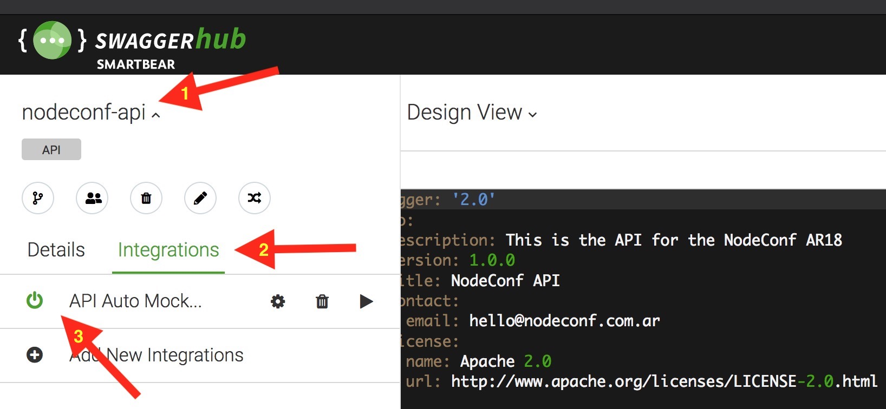
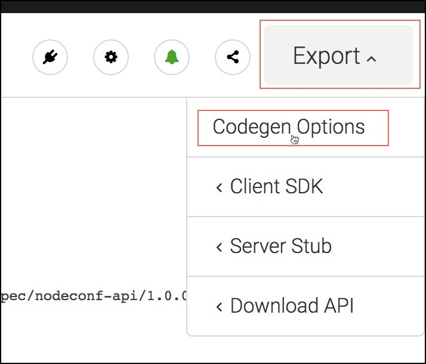
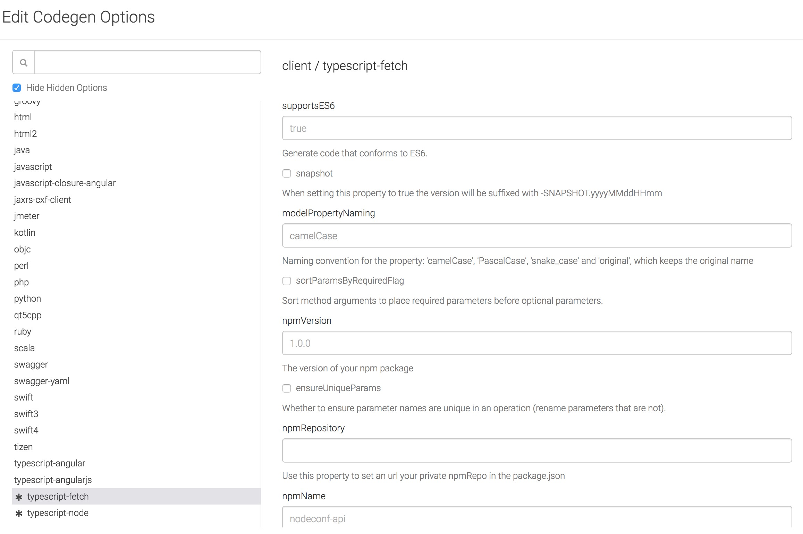
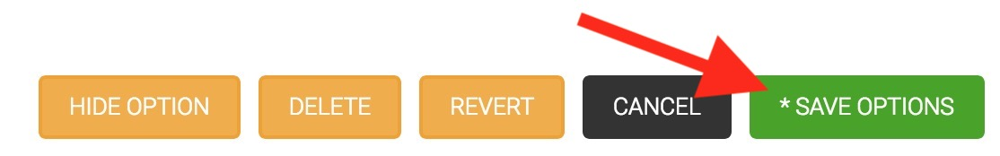
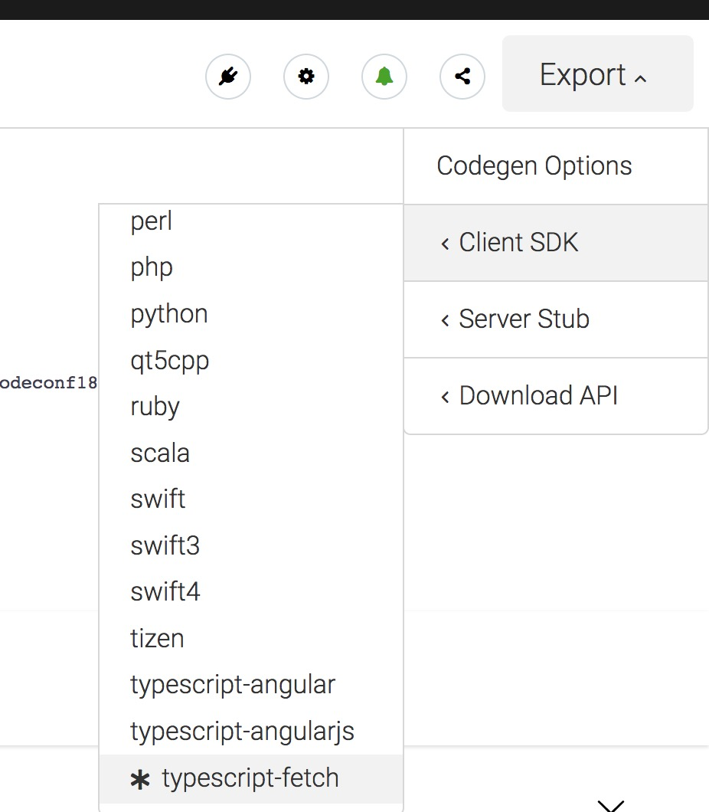

# Exercise 2: Autogenerating a client SDK and connecting to the auto-mocked backend

In this exercise, you will connect a UI to the auto-mocked backend so that you can develop the client/UI that will
consume the API without having to implement the server first. To do so, you'll generate a Client SDK directly from
the API Specification, without manually coding the API calls.

In order to do so, we'll have to:
- Ensure that the API Auto Mocking integration is on
- Set up the given UI that will call the specified API
- Configure some options for the autogenerated client SDK
- Generate that Client SDK
- Add that SDK to our UI
- Use that SDK in our UI to integrate with the auto-mocked backend

## Ensure API Auto Mocking integration is on

API Auto Mocking provides a mocked backend autogenerated from the OAS Document. It is an integration of SwaggerHub which
is on by default, but let's check just in case that it's on. To do so, click the `API integrations` button on the upper
right side. You should see the `API Auto Mocking` item in there, meaning that it is already added to your API.



## Set up the UI

In the folder `exercise-2/nodeconf-client-ui`, run **using node 8 or greater**:
```
npm install
```

Then, you can start it by simply running
```
npm start
```

which will open a browser tab and display the UI, which is served by default in `localhost:3000`.

> Changes you make to the codebase in later steps refresh the UI automatically, so you never need to stop & restart the
project.

## Configure the Codegeneration Options

1. From SwaggerHub, while you are editing your API, go to `Export > Codegen Options` in the upper-right corner.

    

2. In the options pop-up modal, search for `typescript-fetch` in the `Clients` section. and select it. In there, set the
following values:
    - _(Optional)_ supportES6: `true`
    - npmVersion: The version of the npm package that will be the Client SDK. Example: `1.0.0`
    - npmName: The name of the npm package that will be the Client SDK. Example: `nodeconf-api`

    

3. Click the `Save` button

    

## Download the Client SDK

1. From SwaggerHub, while you are editing your API, go to `Export > Client SDK > typescript-fetch` in the upper-right
corner, which will download the Client SDK.

    Since you have now set some codegen option for that Client SDK (see previous step), it will display a `*` next to
    the menu entry.

    

2. Unzip the downloaded file.

3. In the unzipped folder, run `npm install`. This will install the dependencies that the SDK requires and transpile the
typescript SDK to javascript.

## Add that SDK to our UI

There are a number of possible approaches to do this:
- Publish the Client SDK to `npm` and install that package from npm in the UI project, or
- Use `npm link` to use the local Client SDK you've downloaded in your machine from the UI project, or
- In the UI project, `require`/`import` the path to your local Client SDK folder.

For the purpose of this workshop, we recommend either linking the local package or importing the local folder directly.
Therefore, **choose one of the following approaches**.

### To `npm link` the local package

> This approach is similar to publishing the package to `npm` and then downloading it.

1. From the directory of the downloaded client SDK, run `npm link`
1. From the directory of the client UI, run `npm link <your-client-sdk-package-name>` (use the name you've set in the
Codegen options, e.g. `nodeconf-api`, and *not* the directory name).
1. Then, from the UI code you can `require`/`import` the package using that name (e.g. `nodeconf-api`).
    ```js
    // Replace the package name with what your client sdk package name
    import {DefaultApi} from 'nodeconf-api';
    ```

### To require/import the local package

> This approach is similar to just adding the client SDK code as part of your UI's repository.

1. Move the downloaded client SDK code to a folder within the `src/` directory inside the UI code, or create a symlink
there to where you've downloaded (run `ln -s ~/Downloads/typescript-fetch-client-generated .` from within the `src/`
folder).
1. Then, from the UI code, simply `require`/`import` the path to the folder containing the SDK instead of a
package name that is in the UI's `package.json`.

    ```js
    // Replace the path with that of the folder with the client SDK in your machine
    // (it has to be within the src/ folder due to security that the browser imposes, so you cannot import files from
    // directories outside the scope of your UI project)
    import {DefaultApi} from './typescript-fetch-client-generated';
    ```

## Use the SDK

Now that you have the client SDK added to our UI, it's time to actually make requests to the (auto-mocked) backend!

1. Instantiate the imported `DefaultApi` by doing:
    ```js
    const api = new DefaultApi();
    ```
1. Call the backend to fetch the event speakers list by doing:
   ```js
   // The following line returns a Promise that either resolves to the response body, or rejects with the entire
   // response object (when the status code is not 2xx).
   api.editionsEditionIdSpeakersGet(2018);
   ```

That's it! You've now called the auto-mocked backend to fetch the list of speakers :tada:

# Final exercise comments

- There are actually other ways to use the client SDK. The above example uses its object-oriented interface, but it also
exposes an interface more aimed at functional programming (check `DefaultApiFp` in the autogenerated code).

- By default, the client SDK uses [isomorphic-fetch](https://www.npmjs.com/package/portable-fetch), but it also allows
you to pass in other implementations of `fetch` if you prefer. This may be useful to use together with
[zipkin](https://www.npmjs.com/package/zipkin-instrumentation-fetch), for example.

- The client SDK by default uses the backend URL that you've specified in your OAS Document, but it can be overridden in
the code (see the next exercise! :smirk:).
