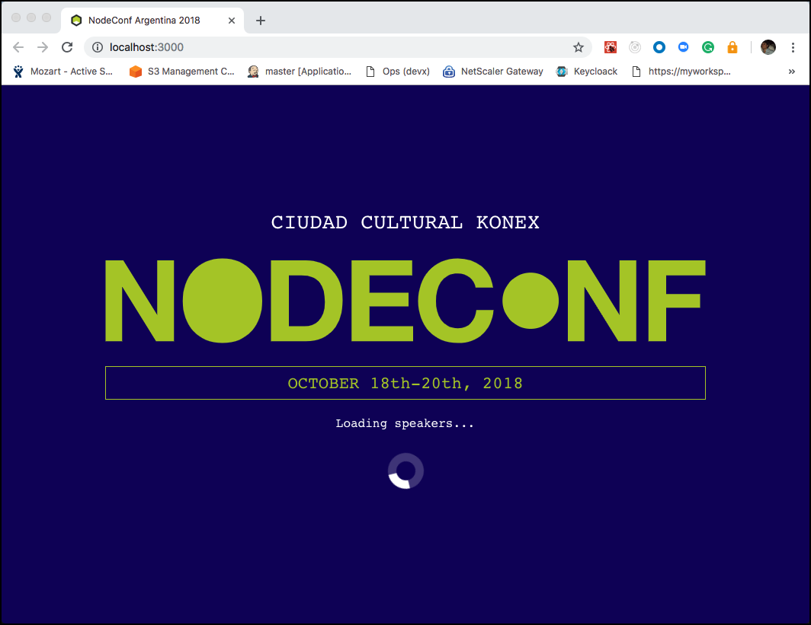
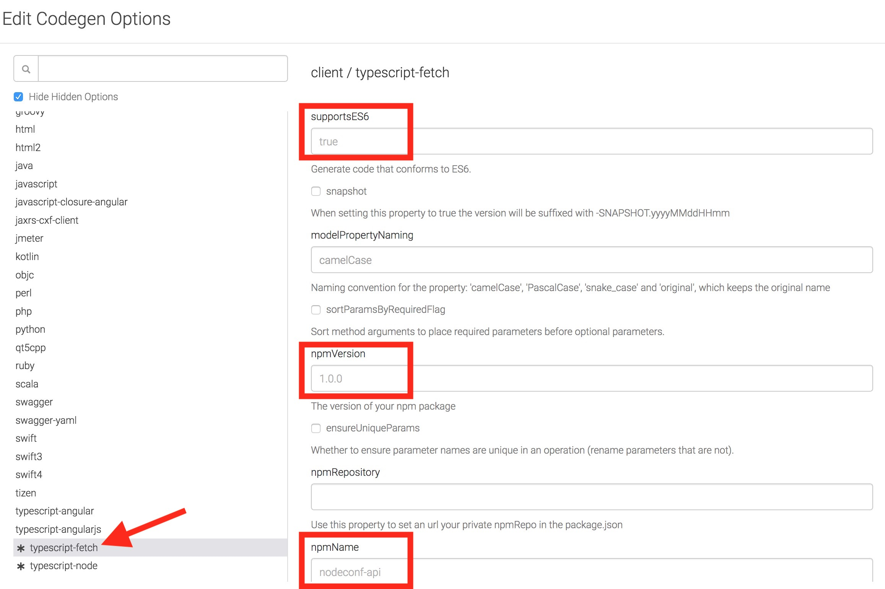
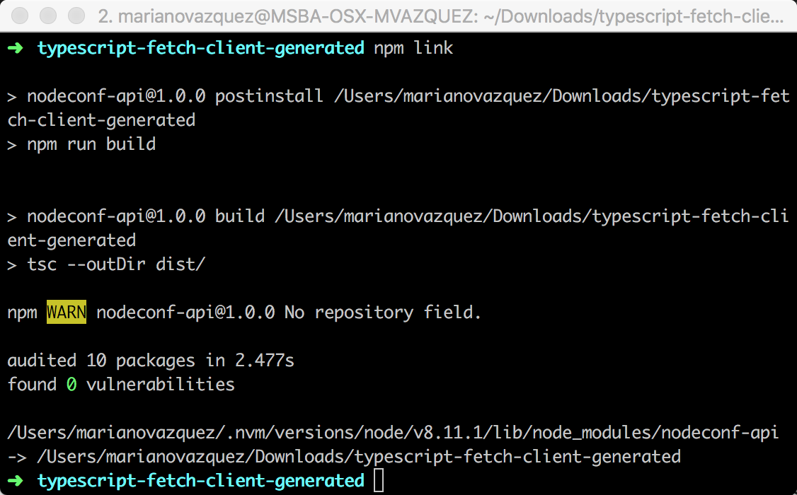
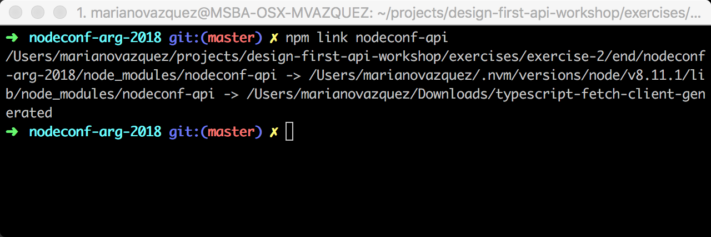
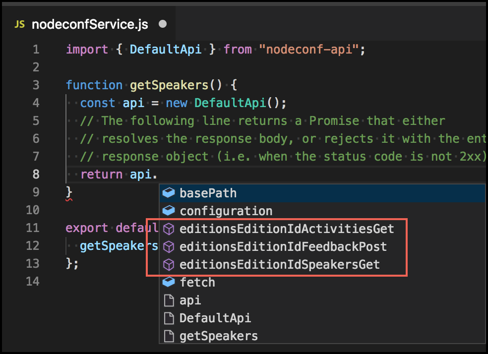
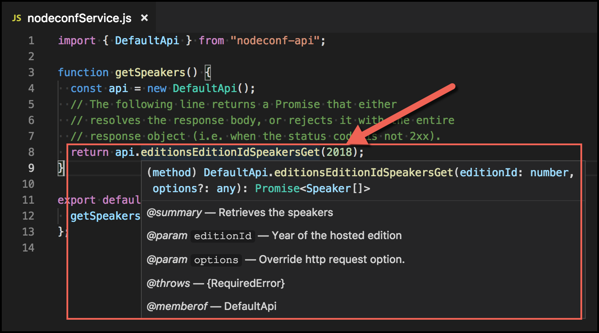
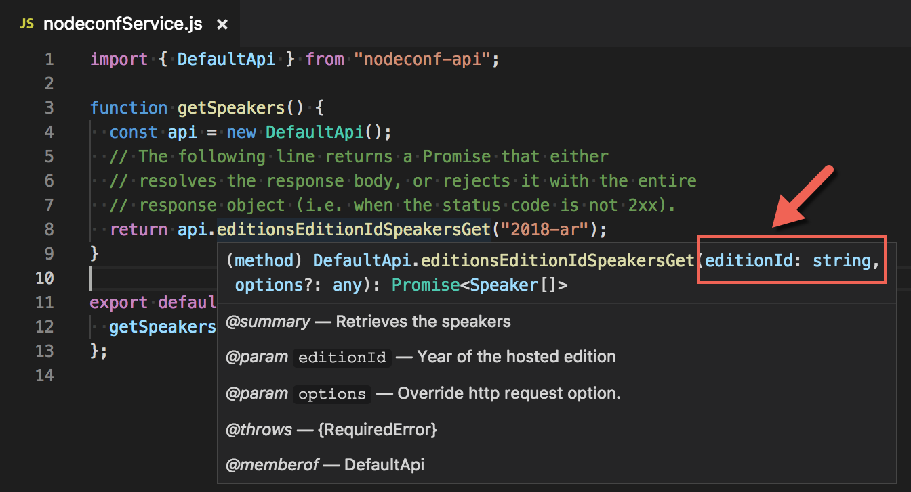

# Exercise 2: Using the autogenerated Client SDK to develop a user interface

In this exercise, you will learn how to connect a client to your newly created API definition. This will help your team to develop a UI (web-based, mobile, etc.) using a clear contract and without worrying about the backend implementation. For this, you will generate a Client SDK directly from the API definition that will encapsulate the logic to connect to the API and make calls to retrieve data from it.

To do this, you need to make sure that a few things are properly set:

## Ensure API Auto Mocking integration is on

The **API Auto Mocking integration** auto-generates a mocked backend directly from your API definition on every Save. It is enabled by default in your API and you easily validate it by just checking that this code snippet is present in your API definition.

```
swagger: '2.0'
...
# Added by API Auto Mocking Plugin
host: virtserver.swaggerhub.com
basePath: /nanovazquez/nodeconf-api/1.0.0
schemes:
 - https
```

In case it is not turned on, follow these steps:

1. Open [SwaggerHub](https://app.swaggerhub.com/) and navigate to the API definition you created in the previous exercise.
1. Click the API name (`nodeconf-api`) located in the top left section of the page.
1. Switch to the `Integrations` tab.
1. Validate that the `API Auto Mocking` item is there and it's on.

   

> **Note:** Learn more about this integration and what you can do with it [here](https://app.swaggerhub.com/help/integrations/api-auto-mocking).

## Introducing the NodeConf Argentina 2018 app

In the **begin** folder of this exercise you can find the **nodeconf-arg-2018** app. This web-based UI was created using [Create React app](https://github.com/facebook/create-react-app) with the sole purpose of displaying the speakers of the conference. It is a simple implementation, but you are going to use it to showcase how **any** client can connect to your API definition by following a very few simple steps.

Before starting this exercise, try running this app locally by following these steps:

1. Open a terminal in the **exercise-2/begin/nodeconf-client-ui** folder.
1. Run `npm install` to install all the dependencies of this project.
1. After all the packages were installed, run `npm start` to initialize the app in the development server. This script will also open a browser tab and display the UI, which is served by default in http://localhost:3000. If everything is OK, you should see something like this:

   

One of the benefits of _Create React app_ is that any changes you make to the codebase in later steps refresh the UI automatically, so you never need to stop & restart the project. Take a minute or two to review this app: for instance, notice that is consuming a **nodeconfService.js** file that returns a `undefined` list of speakers. You are going to implement this function later in this exercise.

> **Note:** You can find more information about React and Create React app [here](https://github.com/facebook/create-react-app).

## Generating the Client SDK of your API

In this section, you'll learn how to connect your UI (or any other client) with your API. For this, you will download the autogenerated Client SDK of your API, and you will install it in your web app just like any other dependency.

1. The first step for this is to configure the code generation options in SwaggerHub. Open a new browser window and navigate into [SwaggerHub](https://app.swaggerhub.com).
1. Choose the **NodeConf API** you created in the previous exercise.
1. Click the **Export** button located at the top right of your API Design view and then click **Codegen Options**.

   

1. A modal window will appear. In its left pane, search for **typescript-fetch** inside **Clients** and select it.
1. In the **client / typescript-fetch** pane on the right, enter the following values:

   - supportES6: `true`
   - npmVersion: `1.0.0`
   - npmName: `nodeconf-api`

   

1. Finally, click the **Save options** button.

   

1. Now you are ready to download the Client SDK of your API. For this, click the **Export** button again but this time choose **Client SDK** and **typescript-fetch**.

   

   > **Note:** Since you have now set up some codegen option for the Client SDK (see the previous step), SwaggerHub will display a `*` next to the menu entry.

1. A zipped file will start downloading. When it completes, unzip it.
1. Open a terminal in the unzipped folder and install the project's dependencies by running `npm install`. Notice that this will also transpile the SDK code to JavaScript, making it ready to use by any client app.

> **Note:** There are more than 30 different ways you can generate a Client SDK, like `Android`, `Go`, `Java`, `Kotlin`, `Ruby`, `Scala`, `TypeScript Angular`, etc. To learn more about them, see [this](https://swagger.io/tools/swagger-codegen/).

## Integrating the SDK with a client/consumer of your API

Swagger Codegen can simplify your build process by generating server stubs and client SDKs for any API, so your team can focus better on your API implementation and adoption.

Now that you have a Client SDK, you could just publish it as an **npm package** and then add it as a dependency of your client (a web app in this case). To simplify this experience, you are going to use [npm link](https://docs.npmjs.com/cli/link) instead, a tool that is often used to test packages locally in the consumer before publishing them.

> **Note:** If you want to learn more about npm and how to publish an npm package, see [this](https://docs.npmjs.com/getting-started/publishing-npm-packages).

1. From the directory of the downloaded client SDK, open a terminal and run `npm link`. This approach is similar to publishing a package, but instead of uploading your package to the public **npm**, you are (sym)linking this folder with the global npm folder that resides in your computer (**{prefix}/lib/node_modules/nodeconf-api**).

   

1. Next, open a terminal in the directory of the UI, **exercise-2/begin/nodeconf-arg-2018** and run `npm link nodeconf-api`.

   

   > **Note:** Notice that _nodeconf-api_ is the name of the Client SDK npm's package, and is the value you have previously set in the **Codegen options**. This value is also present in the **name** property of the Client SDK's package.json file.

1. You now have everything you need to update the UI's code. Open it with Visual Studio Code.
1. Navigate to the **nodeConfService.js** file located in the **nodeconf-arg-2018/src** folder.
1. Add the following **import** statement at the beginning of the file to include the Client SDK library in the code.

   ```js
   import { DefaultApi } from "nodeconf-api";
   ```

1. Now, replace the content of the `getSpeakers()` function with the following code. The Client SDK provides different ways to use it, in this exercise you are going to use the _object-oriented_ interface.

   ```js
   function getSpeakers() {
     const api = new DefaultApi();
     // The following line returns a Promise that either
     // resolves the response body, or rejects it with the entire
     // response object (i.e. when the status code is not 2xx).
     return api.editionsEditionIdSpeakersGet(2018);
   }
   ```

   > **Note:** The autogenerated Client SDK library you have just installed is not only fully functional, but also it provides IntelliSense (thanks to the TypeScript) that will teach to how to consume it.
   >
   > - It will show you the available functions this library has, providing a function per operation in your API.
   >
   >   
   >
   > - It will show you the contract of each function, telling you exactly which parameters you need to send to each function.
   >
   >   

1. Execute the UI locally by running `npm start` in the root folder of the app.

   

Notice that after these changes your UI is getting a list of speakers (even if it is a single one). This is because you now are calling the same auto mocked API that you used in the previous exercise. But from the UI's point of view, it is like the real API: with just a few steps, you allowed the frontend team to build the UI following a clear contract and using examples.

In the next section, you will learn how to update the SDK when your API definition changes.

### Updating your Client SDK with the latest changes of your API

In the next section, you are going to learn how to refresh your Client SDK with the latest changes in your Client SDK. You should expect incremental changes in your API while developing that will generate new patch or minor versions of your npm published SDK.

For this workshop, you are going to continue using **npm link**, but the idea remains the same.

1. Open [SwaggerHub](https://app.swaggerhub.com/) and navigate to the API definition you created in the previous exercise.
1. Jump to the **editionId** definition in the **parameters** field. Change its type to **string**, this will allow us to have different edition names, like `2018-ar` or `2018-eu`.

   ```
   parameters:
     editionId:
       ...
       type: string
   ```

1. Now, download a new version of the Client SDK by clicking the **Export** button at the top right, then **Client SDK** and finally **typescript-fetch**.
1. Unzip the downloaded file, copy its content and replace the contents of the Client SDK folder with these new files.
1. Now, open the UI with Visual Studio Code (located in **exercise-2/begin/nodeconf-arg-2018**) and navigate to the **src/nodeconfService.js** file.
1. Move the mouse over `return api.editionsEditionIdSpeakersGet(2018)` line. Notice that this method now expects a **string** instead of a number. In the real-world, you will **commit && push the changes** to the GitHub repository of your Client SDK, then run **npm publish** and finally update the dependency in the UI by running `npm install nodeconf-api`. But in this workshop you don't need to do anything extra as `npm link` takes care of picking up the changes.

   

   > **Note:** if you don't see the changes in the method's contract, you might have replaced the folder itself. Try running `npm link` in the Client SDK and `npm link nodeconf-api` again and then reopen Visual Studio Code.

Congratulations! 🎉🎉 You are now ready to move to the next stage: Creating a real service that implements your API definition.
