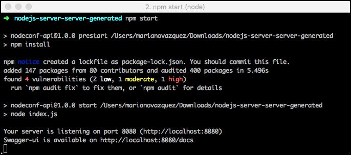
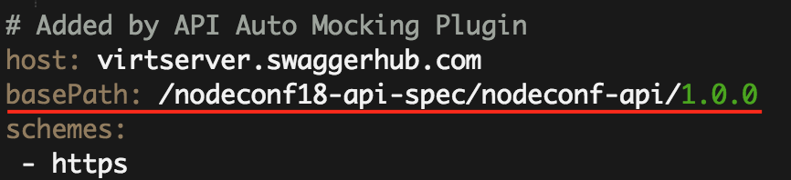
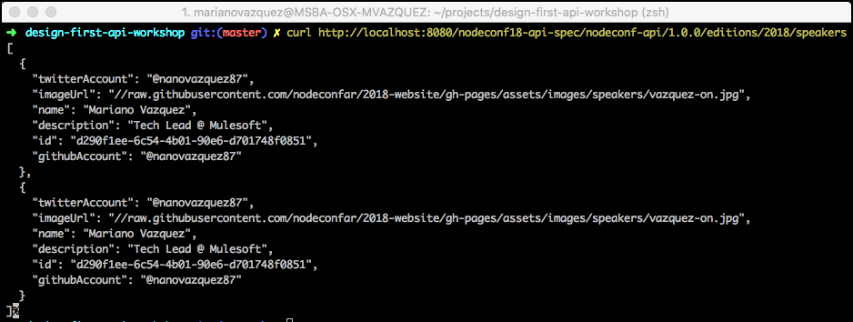
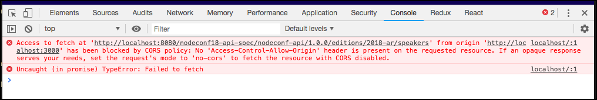
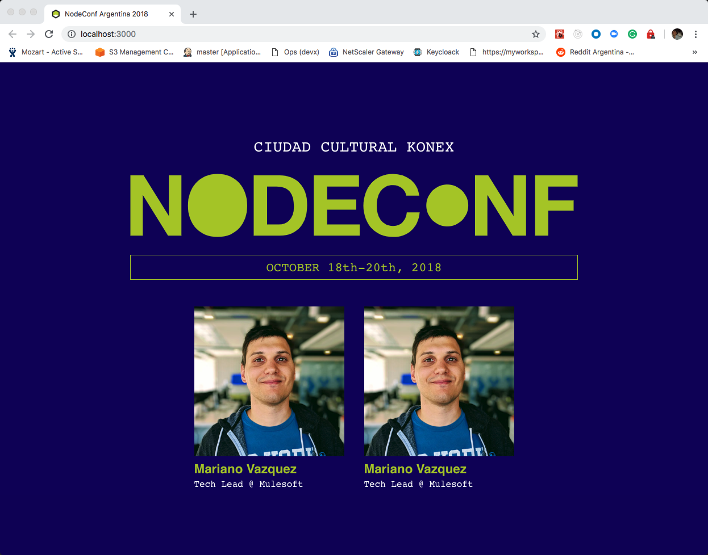

# Exercise 3: Creating a real service that implements your OAS document

In this exercise, you will learn how to leverage SwaggerHub to generate an implementation of your API with just a few clicks. Then, you will then update your API document to point to this real implementation, instead of the API Auto Mocking integration you were using in the previous steps. Finally, you will see how easy is to refresh your clients/consumers to start receiving information from your real backend.

## What is a Server Stub

A Server Stub is nothing more than a basic _implementation of your API_. It is autogenerated using all the information stored in your API document, with the goal of helping you to have a backend implementation of it available for your team at early stages of the development. And with no logic or extra code needed to be added by you.

In this exercise, you will see all the benefits you could get by using it.

> **Note:** Swagger Codegen generates server stubs in more than 20 languages, including Spring, .NET Core, Go, Rails, NodeJS, etc. For more information, see [here](https://swagger.io/tools/swagger-codegen/).

## Generating the Server Stub of your API

Now that you know what a Server Stub is, follow these steps to learn how to generate it, use it and understand what you can do with it.

1. Open a new browser window and navigate into [SwaggerHub](https://app.swaggerhub.com).
1. Choose the **NodeConf API** you created in the previous exercise.
1. Click the **Export** button located at the top right of your API Design view, select **Server Stub** and finally click **nodejs-server**.

   

1. A zipped file will start downloading. When it completes, unzip it.
1. Open a terminal in the unzipped folder set up your project by running `npm start`. This will install all the project dependencies and run a server that will listen any call to http://localhost:8080.

   

   > **Note:** All dependencies will be installed before the server is executed because the _package.json_ file has a **prestart** script configured with `npm install`. You can learn more about npm and the predefined scripts [here](https://docs.npmjs.com/misc/scripts).

### Testing the Server Stub

You can now test your newly created Server stub by hitting any of the endpoints it exposes. How? If you go to your API document in SwaggerHub you will see that it has a **basePath** configured pointing to `/nodeconf18-api-spec/nodeconf-api/1.0.0` (or similar). This value, in combination with the **host** you've just generated (http://localhost:8080) defines the _Base URI_ of your API implementation.



Let's see what you can do with it:

1. Open a browser window and navigate to http://localhost:8080/docs.
1. The Server Stub comes with out of the box documentation of you API, that exposes the same documentation you saw in SwaggerHub, but makes it publicly available for any consumer of your API. It even has the **Try it out!** functionality you tested in Exercise 1. To use it, click the **List operations** link at the right, then click the **/editions/{editionId}/speakers**, enter a value for **editionId** and then click the **Try it out!** button.


1. Similarly, use Postman, curl or a browser to get the list of speakers. For instance, run `curl http://localhost:8080/nodeconf18-api-spec/nodeconf-api/1.0.0/editions/2018/speakers` in a terminal. You should see the same result you saw in the previous step.

   

Pretty neat, isn't it?

## Integrating the Server Stub with clients/consumers of your API

Now that you have your own stubbed server in place, let's connect it with your client application. There are different ways to do this:

1. _(Dev way)_ Manually connect the client application with your Server stub.
1. _(Optional, Pro way)_ Deploy your Server Stub in the cloud, update the API document and the Client SDK.

This worskhop explains you both approaches, but it is OK if you choose only one of them :)

### Manually connect the client application with your Server stub

1. Open the **nodeconf-arg-2018** project located in the **begin** folder of this exercise in Visual Studio Code or use the project of the previous exercise.

   > **Note:** if you are using the (new) project inside the **exercise-3/begin** folder, setup the connection of the UI with the Client SDK via `npm link` before moving forward:
   >
   > - First, open a terminal in **exercise-3/begin/typescript-fetch-client-generated** and run `npm link`.
   > - Next, switch to the **exercise-3/begin/nodeconf-arg-2018** directory and run `npm link nodeconf-api`.

1. Locate the **src/nodeconfService.js** file and open it.
1. In this file, we import the **DefaultApi** class and instantiate a new object of this type. By default, this class has a predefined **base path** that points to the value defined in your API document (i.e. the API Auto Mocking). Override this value with the base path of your local Server stub by replacing line 4 with the following:

   ```js
   const serverStubUrl = "http://localhost:8080/nodeconf18-api-spec/nodeconf-api/1.0.0";
   const api = new DefaultApi({ basePath: serverStubUrl });
   ```

1. Run the app with `npm start`. A new browser window or tab will open, but no speaker will be displayed. Open the Console in the Developer Tools of your browser and notice that, despite you have configured the API properly, the browser rejects the request because your Server does not have CORS configured.

   

1. It is really simple to enable CORS in the Server Stub. Open a terminal in the **typescript-fetch-client-generated** folder that contains your Server stub.

   > **Note:** Alternatively, you could use the Server Stub located in the **begin** folder of this exercise.

1. Install the **cors** package by running `npm install -S cors`.
1. Once installed, open the **index.js** file located in the root folder of this project and import this package.

   ```js
   var cors = require('cors'),
       fs = require('fs'),
       http = require('http'),
       path = require('path');
   ...
   ```

1. Next, add the following lines below the `options` variable to enable all CORS requests in your Server Stub.

   ```js
   var options = { ... }

   // Enable All CORS Requests
   app.use(cors());

   ...
   ```

1. Finally, restart your Server stub and the Client UI by running `npm start` in both root folders. If everything went well, you should be able to retrieve the Speakers list. Notice that the stub returns two speakers using the same example data.

   

   > **Note**: If you inspect the calls between the UI and the server, you will see that the `Access-Control-Allow-Origin: *` header is present in the calls. If you want to know more about CORS, see [this](https://enable-cors.org/).
   >
   > 

1. Let's make some changes in the mocked examples of the Server Stub to retrieve a different set of speakers, simulating how you could test your server after implementing new code. For this, open the **service/DefaultService.js** file of your Server stub. This file contains the mocked data your server is returning to the UI. You will replace this file with a real service as soon as you start coding your business logic, but for now this file suits our needs.
1. Let's increase the number of speakers returned by the GET Speakers request. Scroll down to line 104 and replace the examples array with the following code:

   ```js
   examples["application/json"] = [
     {
       id: "a290f1ee-6c54-4b01-90e6-d701748f0851",
       name: "Suz Hinton",
       description: "Cloud Developer Advocate @ Microsoft",
       imageUrl: "//raw.githubusercontent.com/nodeconfar/2018-website/gh-pages/assets/images/speakers/suz-on.jpg"
     },
     {
       id: "b290f1ee-6c54-4b01-90e6-d701748f0851",
       name: "Dan Shaw",
       description: "Strategic Advisor",
       imageUrl: "//raw.githubusercontent.com/nodeconfar/2018-website/gh-pages/assets/images/speakers/dan-on.jpg"
     },
     {
       id: "c290f1ee-6c54-4b01-90e6-d701748f0851",
       name: "Franziska Hinkelman",
       description: "Co-creator of the Beaker Browser",
       imageUrl: "//raw.githubusercontent.com/nodeconfar/2018-website/gh-pages/assets/images/speakers/fran-on.jpg"
     },
     {
       id: "d290f1ee-6c54-4b01-90e6-d701748f0851",
       name: "Tara Vancil",
       description: "Cloud Developer Advocate @ Microsoft",
       imageUrl: "//raw.githubusercontent.com/nodeconfar/2018-website/gh-pages/assets/images/speakers/tara-on.jpg"
     }
   ];
   ```

1. Restart your Server stub and the Client UI by running `npm start` in both root folders. Now you should see more speakers in the browser:

   

Yay!

### (Optional) Deploy your Server Stub in the cloud, update the API document and the Client SDK

Deploying you server stub on the cloud will enable anyone to consume it, and so anyone from the team can work on the project and use the same implementation of the API for consistency.

There are lot of solutions that take care of uploading and deploying, like for example: Heroku or Now.

> **Note**: For the simplicity of it, in this workshop we are going to see how to use Now. If you prefer using Heroku but have never used it, you can follow this [Getting Started on Heroku with Node.js](https://devcenter.heroku.com/articles/getting-started-with-nodejs) tutorial.

To upload the project with [Now](https://zeit.co/now):

1. Install the cli globally by runnning the following command: `npm install -g now`

1. Inside your server stub project folder, run the command `now`

   - If it's your first time using it, it will ask you for your e-mail, and afterwards it will send you instructions on how to register an account. Follow these steps and once your account has been verified, run the `now` command again.

1. It will verify that is ok to have it deployed publicly (As this is a free account it's the only way. You can find out more about premium plans [here](https://zeit.co/pricing))

1. Wait for it to finish uploading and deploying and you are done.

You have now deployed your server stub on the cloud and can use it from whenever you want!

In order to use it on the UI we've been working on this workshop, you just need to update the main base uri as the _basePath_ of the _DefaultApi_ to point to the one provided by _Now_.

```

```

Congratulations! 🎉🎉🎉 This concludes the set of exercises we have prepared for you. Go grab a ☕ (or a [mate](<https://en.wikipedia.org/wiki/Mate_(drink)>))!
