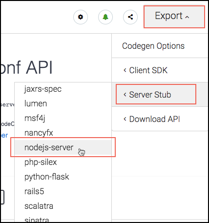

# Exercise 3: Using a Server Stub as a Backend

In this exercise, you will learn how to leverage the capabilities of an autogenerated server stub. You will start with a small introduction to what a server stub is and why is it important. Then, you will move onto a hands on section and generate the server stub related to your OAS Document, investigate the different benefits that are brought out of the box, and finally connect it to the UI app.

Let's begin then!

## What is a Server Stub

A Server Stub is nothing more than an **implementation of your API**. It's autogenerated code that takes what you've specified throughout your OAS Document and makes it available to be consumed as a small server by stubbing methods (You will analyze in a coming section how are these methods stubbed)

You might be thinking why going through the trouble of autogenerating code of your API is useful. It's understandable. So here are two reasons that might convince you:

- First of all, you will be able to have a working server without the need of having to implement any kind of logic. This will help you in parallelizing the work being done between UI and Backend.

- Second of all, it is super simple!

## Converting your OAS Document into an Autogenerated API Implementation

So, how can you do this? How can you go from an OAS Document to a Server Stub and use it?

**Generating the Server Stub**

First you need to create it by following these steps:

1. Open the API page in SwaggerHub.

2. Look for the Export menu on the upper-right section, click it, select *Server Stub* and then the **nodejs-server** option.



3. Once it finishes downloading, unzip it.

```
$ unzip nodejs-server-server-generated.zip -d nodejs-server-server-generated
Archive:  nodejs-server-server-generated.zip
  inflating: nodejs-server-server-generated/service/DefaultService.js
  inflating: nodejs-server-server-generated/utils/writer.js
  inflating: nodejs-server-server-generated/controllers/Default.js
  inflating: nodejs-server-server-generated/README.md
  inflating: nodejs-server-server-generated/index.js
  inflating: nodejs-server-server-generated/api/swagger.yaml
  inflating: nodejs-server-server-generated/.swagger-codegen-ignore
  inflating: nodejs-server-server-generated/.swagger-codegen/VERSION
  inflating: nodejs-server-server-generated/package.json
```

Great! You now have an implementation of your API waiting to be configured and run. For this, you just need to run the command `npm start` inside the decompressed folder.

```
$ npm start

> nodeconf-api@1.0.0 prestart /Users/sebastianrodriguez/Documents/ot/projects/design-first-nodeconf/nodejs-server-server-generated
> npm install

npm WARN deprecated formidable@1.0.17: Old versions of Formidable are not compatible with the current Node.js; Upgrade to 1.2.0 or later
npm notice created a lockfile as package-lock.json. You should commit this file.
added 147 packages in 7.812s

> nodeconf-api@1.0.0 start /Users/sebastianrodriguez/Documents/ot/projects/design-first-nodeconf/nodejs-server-server-generated
> node index.js

Your server is listening on port 8080 (http://localhost:8080)
Swagger-ui is available on http://localhost:8080/docs
```

What just happenned?

- A _prestart_ script was run, installing all the missing dependencies (`"prestart": "npm install"`)

- The _start_ script was run and started a localhost server (`"Your server is listening on port 8080 (http://localhost:8080)"`)

- Finally, it stated that there is a `"Swagger-ui available"`. You'll see what this is in a bit.

And that's it, you have a Server Stub of your OAS Document up & running, ready to be consumed. Let's try it out!

### Testing the Server Stub

In order to test if it's running as expected, you can hit any of the endpoints that were written down on the OAS Document, like retrieving all the speakers.

Going back to the OAS Document, you will see that:

- The API has a _basePath_ at the bottom, with the following format: **/{owner-name}/{api-name}/{api-version}**

- To retrieve the speakers, you need to do a **GET** to **/editions/{editionId}/speakers**

Combining these two things, plus the localhost baseUri, you get the following endpoint:

`http://localhost:8080/{owner-name}/{api-name}/{api-version}/editions/{editionId}/speakers`

Replace _editionId_ for a valid integer number (like it was defined in the parameter schema) and consume the endpoint with your preferred way (Browser, Postman, curl, etc). For example:

```
$ curl http://localhost:8080/nodeconf18-api-spec/nodeconf-api/1.0.0/editions/2018/speakers
```

And you will see a response
```
[
  {
    "twitterAccount": "@john-doe",
    "imageUrl": "http://some.image.com/image.png",
    "name": "John Doe",
    "description": "Node JS Developer",
    "id": "d290f1ee-6c54-4b01-90e6-d701748f0851",
    "githubAccount": "@i-am-a-developer"
  },
  {
    "twitterAccount": "@john-doe",
    "imageUrl": "http://some.image.com/image.png",
    "name": "John Doe",
    "description": "Node JS Developer",
    "id": "d290f1ee-6c54-4b01-90e6-d701748f0851",
    "githubAccount": "@i-am-a-developer"
  }
]
```

It works!

**Investigating under the hood**

So, when testing the Server Stub, you saw a pretty familiar response, right? Well, yes!

The server is using all the information you placed on your OAS Document to return a proper response. Let's do a quick analysis how this is being done.

Go to the Server Stub project folder and open the `DefaultService.js` file contained inside the `service` directory.

You will notice that this service is exporting all of the different endpoints your OAS Document defined as functions. For example:

```javascript
exports.editionsEditionIdActivitiesGET = function(editionId,searchString)
```

And all functions are returning with harcoded values. They are the ones you placed as examples in the responses section of each endpoint.

This information is fed to the `Default.js` controller (located in the `controllers` directory) that, same as the service, exports a function for each endpoint.

This controller is finally used in `index.js`. This is the app main entry file. You will see that it does a couple of things.

First, it initializes a middleware, with the spec you wrote, that will be in charge of:

- Interpreting Swagger resources and attach metadata to request

- Validate all incoming requests and see if they are valid against the spec (endpoints exist, schema is valid, etc)

- Route requests to the appropriate controller (In this case, to the `Default.js` controller)

- Serve the **Swagger-UI**

> **Note**: All these out of the box tools are provided by the module swagger-tools. You can read more [here](https://www.npmjs.com/package/swagger-tools)

Finally, it starts a simple http server.

That's all it needs to generate and create a Stub Server of your OAS Document. Pretty neat, isn't it?

## Benefits

**Temporal Working Server**

The first and most clear benefit of having a Server Stub is that, without the need of implementing logic, you have a working server that behaves exactly like the definition on your OAS Document.

With this, you can easily paralellize the work being done between different parts of the same project; and while the logic is being implemented, you can keep using the stub server as a temporal replacement to work on your part.

In the end, it should be as easy as changing the main base uri of the server you are consuming (You are going to see how to do this in the section below)

**Autogenerated docs**

An additional benefit of having a server stub, is that it comes with out of the box documentation of you API.

If you remember when you run the `npm start` command, the last line stated:

```
Swagger-ui is available on http://localhost:8080/docs
```

If you go to that location, you'll see that you are exposing the documentation of your API; so anyone with access to this server stub can check it and even try it! Yes, it has bundled the **Try it out!** behavior on each of the endpoints, same as it has on the API page on SwaggerHub.


## Connecting the dots

Now that we have our own stubbed server, let's make the UI App use it instead of the client SDK and the mocking service.

1. First, go to the UI App folder and open the `App.js` file

2. Define the basePath where the Server is running. Probably it would be something like:

```javascript
import {DefaultApi} from 'nodeconf-api';

...

const url = 'http://localhost:8080/{username}/{api-name}/{api-version}';
```

3. Locate the line where you are instantiating the DefaultApi and add the **url** you just declared as the *basePath* argument

```javascript
const url = 'http://localhost:8080/nodeconf18-api-spec/nodeconf-api/1.0.0';

/* Instantiate the SDK */
const api = new DefaultApi({basePath: url});

```

> **Note**: For this workshop is enough reusing the Client App to consume our server stub for a quick ramp-up. Eventually, you are probably going to create a Service that handles all calls to the backend/server stub.

Last, but not least, we should enable CORS in the Server Stub to allow calls between both services. For this you need to:

1. Go to the Autogenerated Server Stub folder

2. Open the `package.json` file and set **cors** as a new dependency

```javascript
...
  "dependencies": {
    "connect": "^3.2.0",
    "cors": "^2.8.4",
    "js-yaml": "^3.3.0",
    "swagger-tools": "0.10.1"
  }
```

3. Open the `index.js` file and import the new dependency and make the app use it

```javascript
var cors = require('cors'),
    fs = require('fs'),
    http = require('http'),
    path = require('path');

var app = require('connect')();
...

// Enable All CORS Requests
app.use(cors());
```

And that's it! Start both services (the Server Stub and the UI App) and open the App to see if the changes are working correctly. If everything went well, you should be able to retrieve the Speakers list. Moreover, if you now make changes to the mocked examples the Server Stub is giving as response, you should see them reflected in the UI App.

> **Note**: If you inspect what the UI is doing, you'll se that is making the call to the Server Stub instead of using the SDK (And in the response headers, the one it enables CORS `Access-Control-Allow-Origin: *` )
> 

## Bonus track

Additionally to what you've done already, you can go a step further and provision that this server stub is:

**Versioned**

For this, you can follow this very simple [steps](https://help.github.com/articles/adding-an-existing-project-to-github-using-the-command-line/) in order to setup your project and upload it to GitHub

**Running online**

Deploying you server stub on the cloud will enable anyone to consume it, and so anyone from the team can work on the project and use the same implementation of the API for consistency.

There are lot of solutions that take care of uploading and deploying, like for example: Heroku or Now.

> **Note**: For the simplicity of it, in this workshop we are going to see how to use Now. If you prefer using Heroku but have never used it, you can follow this [Getting Started on Heroku with Node.js](https://devcenter.heroku.com/articles/getting-started-with-nodejs) tutorial.

To upload the project with [Now](https://zeit.co/now):

1. Install the cli globally by runnning the following command: `npm install -g now`

1. Inside your server stub project folder, run the command `now`
   * If it's your first time using it, it will ask you for your e-mail, and afterwards it will send you instructions on how to register an account. Follow these steps and once your account has been verified, run the `now` command again.

1. It will verify that is ok to have it deployed publicly (As this is a free account it's the only way. You can find out more about premium plans [here](https://zeit.co/pricing))

1. Wait for it to finish uploading and deploying and you are done.

You have now deployed your server stub on the cloud and can use it from whenever you want!

In order to use it on the UI we've been working on this workshop, you just need to updaed the main base uri to point to the one provided by *Now*.
